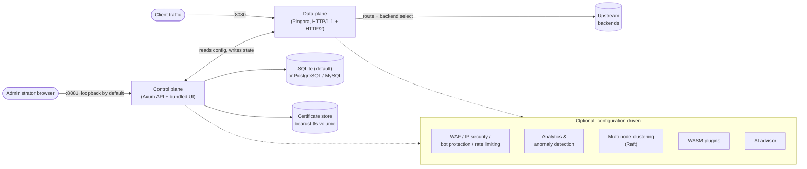
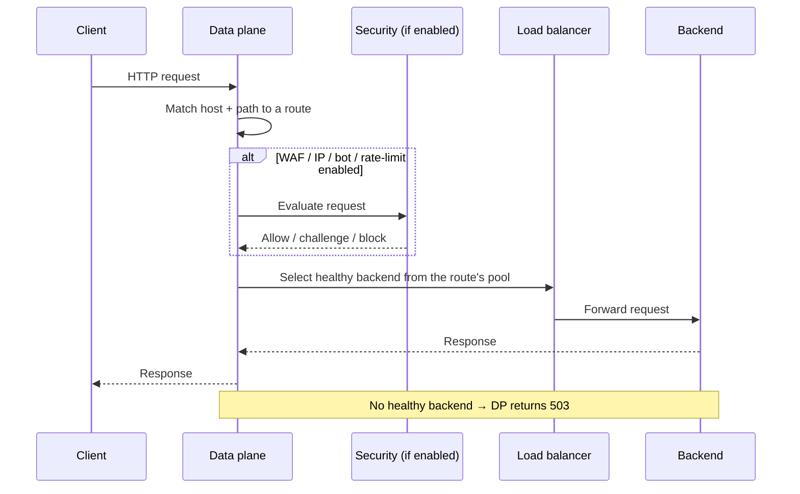

# Architecture

Bearust separates request handling from operational management while keeping both processes driven by the
same validated configuration and persistent control-plane state. Both halves run inside one binary and one
container — there is no separate service to deploy or keep in sync.

## System overview



The data plane and control plane are two logical halves of the same process: the data plane serves traffic,
the control plane manages configuration and state, and everything in the dashed box is inactive until you
configure it. See [feature status](./feature-status) for exactly what ships on versus opt-in.

## Request path



Health checks (TCP or HTTP) continuously probe each backend; an unhealthy backend is excluded from
selection until it recovers.

## Data plane

The Rust data plane uses Pingora for the HTTP/1.1 and HTTP/2 proxy listener. It receives client traffic,
resolves the request host and path to a route, selects a healthy backend from the route's upstream pool,
and forwards the request.

The primary listener is port `8080` in the Docker Compose deployment. Native TLS is optional. HTTP/3 is also
optional: it uses a separate QUIC listener and requires TLS, so it is not part of the default listener
configuration.

## Control plane and UI

The Axum control plane exposes authenticated setup and management APIs, and the bundled UI uses those same
APIs — the UI is a client, not a second backend. In the supplied Compose files, port `8081` is published on
`127.0.0.1` only. This is deliberate: do not publish the management port broadly without a separate access
and TLS design.

Persistent control-plane data defaults to SQLite in the `bearust-data` Docker volume. Certificate material is
stored in the separate `bearust-tls` volume. The control plane can use an opt-in PostgreSQL or MySQL Compose
profile instead of SQLite.

## Optional subsystems

Security controls (WAF, IP rules, bot protection, and rate limiting), analytics, clustering, WASM plugins,
and the AI advisor are separate subsystems around the core request path. They are configuration- or
environment-driven; the AI advisor, for example, stays disabled without both provider URL and API key.
Review [feature status](./feature-status) before enabling these capabilities in production.

## Reloading configuration

Validate a configuration before use, replace the mounted TOML atomically, and send `SIGHUP` to reload the
running service. The Compose equivalent is:

```sh
docker compose kill -s HUP bearust
```

See [Configure your first proxy](../getting-started/first-proxy) for the configuration structures this
reload applies.
