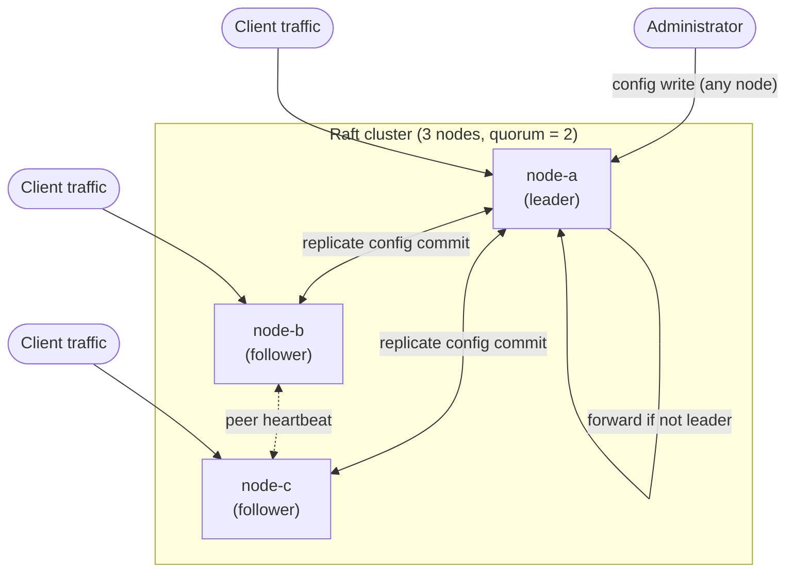

# High availability and clustering

Clustering is optional. With no configured peers, Bearust operates as a standalone node; cluster status
reports clustering as disabled and standalone configuration does not require peer credentials. Configure
peers only when you are deliberately operating a Raft-backed control-plane cluster.

## What Raft actually does here

Raft is a consensus algorithm: a way for multiple independent nodes to agree on one shared sequence of
changes, even if some nodes are slow, restarting, or briefly unreachable. Bearust uses Raft (via the
`openraft` library) to replicate **control-plane configuration** — routes, upstream pools, security policy,
and other administrative state — across every node in a cluster, not to replicate live request traffic
itself. Each node still serves its own data-plane traffic independently; clustering keeps their
configuration consistent.

At any moment, a Raft cluster has exactly one **leader** and the rest are **followers**. Only the leader
accepts new configuration writes; it replicates each write to a majority of nodes (a **quorum**) before
considering it committed. If the leader disappears, the remaining nodes elect a new one, as long as a
quorum of nodes can still reach each other.



Every node keeps serving its own data-plane traffic (bottom arrows) regardless of Raft role. Only
control-plane configuration changes flow through the leader and get replicated (top arrows).

## Requirements before you turn this on

- **An odd number of nodes, three or more, to tolerate any real failure.** A 2-node "cluster" has no quorum
  majority if either node drops — that configuration cannot survive a single failure and is not
  recommended. Three nodes tolerate one failure; five tolerate two.
- **Private network reachability between every node's cluster port**, in both directions. This is the peer
  RPC transport (`CLUSTER_PEERS` addresses), separate from the data-plane (`8080`) and control-plane
  (`8081`) HTTP ports.
- **One shared, high-entropy `CLUSTER_AUTH_TOKEN`**, distributed out-of-band (a secrets manager or your
  deployment tool) — never committed to configuration files or documentation examples.
- **A unique `NODE_ID` per node**, and every other node's ID and address listed in that node's
  `CLUSTER_PEERS` — never the local node's own ID.
- **Reasonably synchronized clocks** across nodes (standard NTP is enough). Raft's correctness does not
  depend on wall-clock time, but large clock skew makes timeouts and logs harder to reason about during an
  incident.
- **A firewall that restricts the cluster port to the private network.** The shared token authenticates the
  Bearust peer protocol; it does not design your network perimeter for you.

## Configure each node deliberately

Give every node a unique `NODE_ID`. Configure `CLUSTER_PEERS` per node: list the *other* cluster members,
never the local `NODE_ID`. Bearust rejects a peer entry whose ID matches the local node ID. Use one shared,
high-entropy `CLUSTER_AUTH_TOKEN` for the peer transport. Environment values override the corresponding
cluster configuration values. Keep the token in a secret manager or deployment-secret mechanism; never
commit or paste a real token into configuration examples.

```sh
# node-a
NODE_ID=node-a
CLUSTER_PEERS='node-b=10.0.0.12:7000,node-c=10.0.0.13:7000'
CLUSTER_AUTH_TOKEN='<cluster-shared-secret>'
```

```sh
# node-b
NODE_ID=node-b
CLUSTER_PEERS='node-a=10.0.0.11:7000,node-c=10.0.0.13:7000'
CLUSTER_AUTH_TOKEN='<cluster-shared-secret>'
```

```sh
# node-c
NODE_ID=node-c
CLUSTER_PEERS='node-a=10.0.0.11:7000,node-b=10.0.0.12:7000'
CLUSTER_AUTH_TOKEN='<cluster-shared-secret>'
```

Peer RPC transport authenticates messages with the configured cluster token. This authenticates the Bearust
peer protocol; it does not design your network perimeter for you. Restrict the cluster listener to the
private network, firewall it from untrusted clients, rotate the shared token through a coordinated
deployment, and protect the token as a cluster-wide credential.

**Verify:** start a node with the intended identity and peers, inspect cluster status, and confirm the
local node ID and expected peer count. A peer using a different token must not be accepted as an
authenticated cluster peer.

## Read status before changing configuration

For a configured cluster, use the Raft role, leader ID, term, commit index, peer health, quorum flag, and
sync state as the readiness signal. A leader is ready only with a recent quorum acknowledgement and a
healthy Raft runtime. A follower knowing a leader is not by itself proof of local quorum readiness, so do
not route a critical configuration operation solely because a follower reports a leader ID.

When status reports `quorum_unavailable`, `unavailable`, or a stopped/unknown state, restore quorum before
relying on a replicated configuration change. A standalone node reports its own in-sync state rather than a
peer quorum.

**Verify:** while all configured peers are healthy, confirm one leader and a quorum-ready status. Then
isolate enough peers in a non-production environment to lose quorum and confirm status stops reporting
quorum readiness; restore connectivity and wait for a current leader and commit progress.

## Treat replicated writes as commands

Clustered configuration mutations are replicated Raft commands. Submit a stable command ID for a
configuration write and retain it until its final result is known. If the client loses the response after
submission, retry the *same* command ID rather than creating a new command: this lets the cluster identify a
retried outcome without repeating the intended mutation.

Wait for the command to commit, then verify the resulting configuration from a quorum-ready cluster view. A
transport timeout is not evidence that the command failed; it is an unknown outcome until status or a retry
with the same command ID resolves it.

**Verify:** in a test cluster, interrupt a client after submitting a harmless configuration command, retry
it with the original command ID, and confirm the intended change appears once after commit.

## Keep virtual IP failover separate

Keepalived, VRRP, floating IPs, and load-balancer health checks are host-level availability mechanisms.
Bearust does not configure or operate keepalived for you. Use your platform's host/network runbook to move
client ingress between healthy nodes, and separately validate that the selected node has the cluster
readiness required for control-plane writes.

**Verify:** fail over a test virtual IP using the host-level tooling, confirm clients reach the replacement
node, and separately inspect its Bearust cluster status before performing a replicated configuration change.
